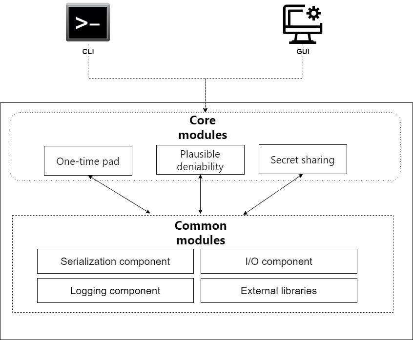

# Contributing to MightyXOR

We welcome any contributors and contributions to this software project. 
Please do not hesitate to open pull requests and ask us about any issue you encounter while writing your code.
If you are here, you already want to help the project, so feel free to ask anything.
As a MightyXOR developer, there are a few recommendations to follow:

## Developer guide

### Building and testing

TODO
### Tips for working with git

You should be familiar with `git` if you want to contribute to the project. As a good tip, however, we provide a sample set of commands for basic needs.

Adding upstream:
```
git remote add upstream https://github.com/juliangrtz/mightyxor
```

Adding a branch based on mightyxor/main to your fork:
```
git checkout upstream/main
git pull upstream main
git switch -c <my-branch>
git push --set-upstream origin <my-branch>
```

## Contribution guidelines

### Adding your feature or fixing a bug

One of the most valuable ways to contribute to the project is to add ideas to [issues](../../issues).
It is highly encouraged to open an issue before creating a pull request (PR).
Then, when you started working on it, we highly recommend opening a draft pull request as soon as possible. This will help everybody see your changes and potentially help you. Then, once PR is ready, open it and wait for a review.

### Types of issues

Issues marked with `Proposal` are those suggesting ideas following the scheme described [here](README.md). If the idea is a good one and is going to be implemented, it is marked as `Accepted`. If an idea cannot be implemented any time soon, it is marked as `Not now`.

`Minor bug` and `Bug` are applied to an issue after it's clear, that the behaviour is not desired. `Minor bug` is for cases, when despite that the behaviour is undesired, the impact is low. `Bug` reflects serious issues.

`Opinions wanted` – anybody is welcomed to share their opinion on a subject.

### Contributing details

You might have some questions about the way you should write your code, or how you could add another cryptographic algorithm etc. It is recommended to check the XML documentation in the source code. A more detailed document for code guidelines is in the works.

## Architecture of the project

There are a few projects the repository contains which consist of various modules each. These are visualized in the following image:

