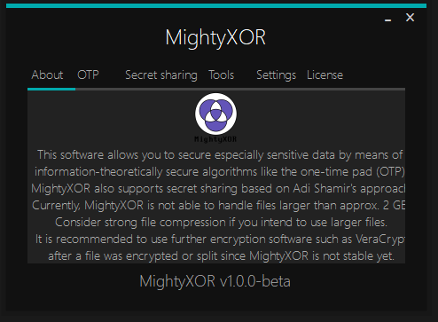

# MightyXOR

MightyXOR is an open source cryptography software suite based on .NET 6 with the primary aim of being information-theoretically secure, meaning its encrypted files cannot be decrypted even if an adversary has unlimited computing resources and time.

It supports various en- and decryption algorithms and techniques, including
- the [one-time pad](https://en.wikipedia.org/wiki/One-time_pad) (OTP),
- [Shamir's secret sharing algorithm](https://en.wikipedia.org/wiki/Shamir%27s_secret_sharing) (SSS) and
- plausible deniability.

## Context

Given the increasing usage of highly efficient quantum computers, the question arises, when – not if – these will be able to break widely used cryptography algorithms like AES or RSA in a short space of time.
Thus, MightyXOR's purpose is to provide a secure environment for especially sensitive data by means of information-theoretically secure techniques. One of these techniques is the one-time pad.
It [was mathematically proven](http://math.umd.edu/~lcw/OneTimePad.pdf) that the one-time pad **cannot be broken** – even with vast computational power.

## Goals
To put it in a nutshell, we are pursuing the following goals:

- Security on all levels
    - Reliable, correctly implemented algorithms such as the OTP
    - Cryptographically secure, (hardware-)generated true randomness
    - Key distribution using Shamir's secret sharing scheme
    - Plausible deniability
- Free, open source software
- Understandable, maintainable, readable source code

In the future, we intend to extend MightyXOR to support more techniques:

- Further information-theoretically secure cryptosystems
- A more efficient sharing scheme, namely the (k, n)-threshold secret sharing scheme described [in this paper](https://www.researchgate.net/publication/220905280_A_New_k_n-Threshold_Secret_Sharing_Scheme_and_Its_Extension)
- An API for hardware random number generators (HRNGs)
- Cross-plattform support for Linux and macOS concerning MightyXOR's graphical user interface

## Plans for the future

- Implementation of more cryptographic algorithms (AES, DES, RSA, NaCl etc.)
- C port for higher efficiency
- Better performance for large files > 4 GB

## Usage

MightyXOR provides a graphical user interface which currently only runs on Windows operating systems.

### CLI (command line interface)

A cross-plattform CLI is being worked on.

### GUI (graphical user interface)

TODO: Add more pictures here

The GUI is based on Windows Forms and will be replaced by a WPF-based application as soon as possible. As depicted in this screenshot, it is divided into several components:

The encryption menu allows both ordinary OTP-based encryption and an extended one-time pad with plausible deniability. In both cases, MightyXOR offers advanced options to customize the encryption process to your choice.

In the decryption menu, an encrypted file can be decrypted using a key. If plausible deniability was used previously, MightyXOR behaves exactly as if it was not used. This way, an attacker would not recognize that an alternative key was involved.

MightyXOR also supports a secret sharing mode according to Adi Shamir's scheme based on polynomial interpolation. Using this mode, a given file can be split into *N* parts whereas *K* parts are required to restore the entire file.

It is recommended to combine MightyXOR's features in order to maximize the security. For instance, it may be feasible to encrypt a sensitive file with a OTP including plausible deniability and split both the encrypted file and keys afterwards. Under the correct circumstances, it is impossible to break this cryptosystem.
## FAQ

### Why C#?!

Good question. A port to C, C++ or Rust is planned.

### What does the name mean?

The name should be self-explanatory. The exclusive OR really is mighty in cryptography.

### Should I use MightyXOR instead of Veracrypt or BitLocker to encrypt my sensitive data?

No. At the moment, MightyXOR does not claim to offer the features a software such as VeraCrypt does. Comparing MightyXOR to other cryptography software is difficult since MightyXOR can be seen as a niche product. Furthermore, MightyXOR encrypts on the file level, whereas VeraCrypt and BitLocker encrypt on the volume level. Consider MightyXOR a useful extension to your cryptography toolset which you can use to en- and decrypt your especially sensitive data.

### How can I contribute to the MightyXOR project?

Any contribution to the MightyXOR project, be it documentation, testing or development is warmly welcome. As an MightyXOR developer, however, it should be your top priority to develop a secure, clean and easy-to-use software product. Security is crucial. Please refer to [this guide](CONTRIBUTING.md) for MightyXOR contributors for more detailled information.

### I am thinking of a new feature for MightyXOR. How can I share it?

Ideas for new features can be posted in the [issues section](../../issues). Please orientate yourself by the following aspects when proposing a new feature:

- Summary
- Motivation
- Detailed design
- *optional:* Drawbacks
- *optional:* Alternatives

Additionally, feel free to create pull requests. Be sure to (at least briefly) explain the points above.

## License

The license is declared [in this file](LICENSE).
